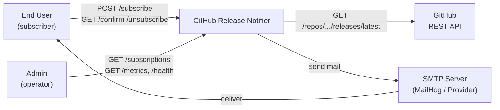
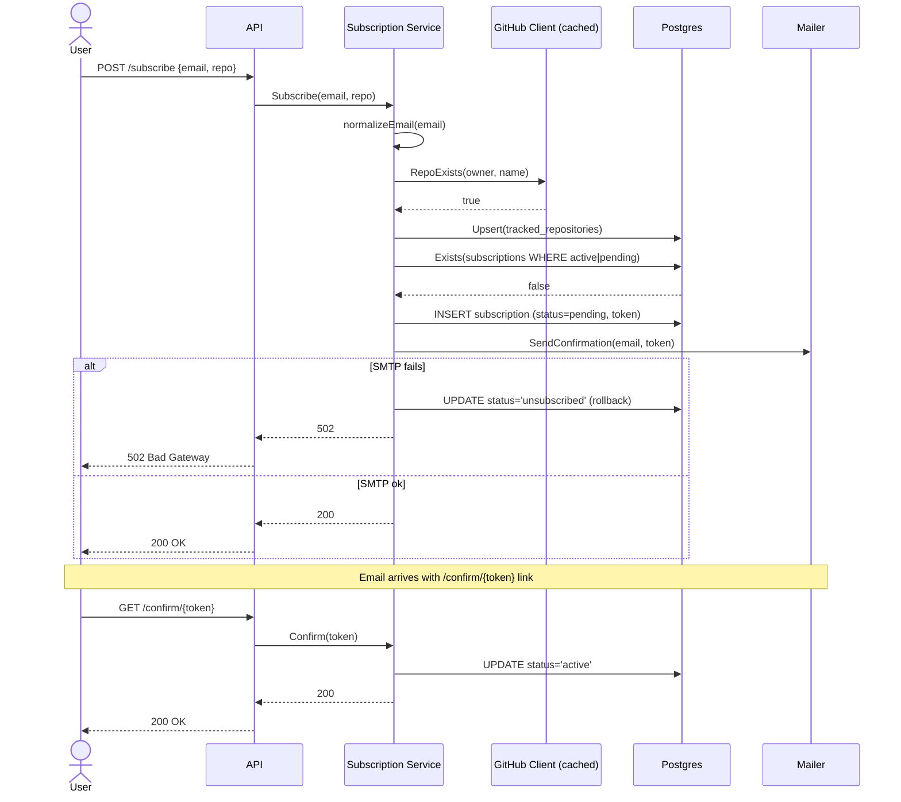
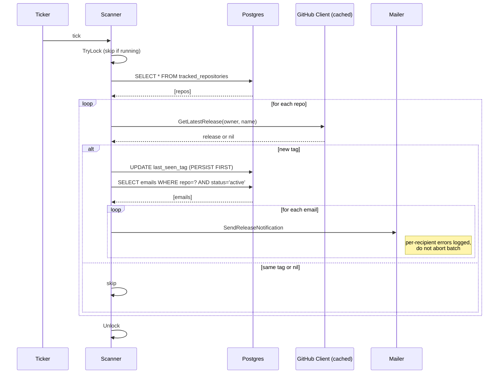
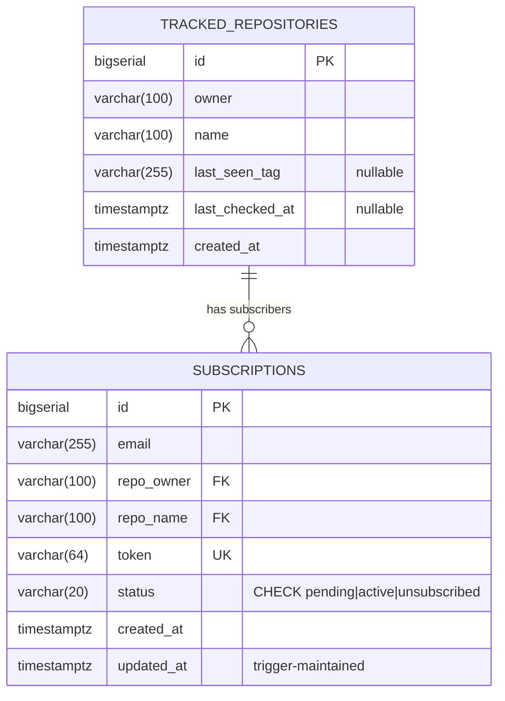

# System Design: GitHub Release Notifier

Author: Project Author | Date: 2026-05-08 | Status: Approved

---

## 1. Overview & Objectives

A backend service that lets users subscribe by email to be notified when a
public GitHub repository publishes a new release. The service runs the full
subscription lifecycle (subscribe → email confirmation → active → unsubscribe)
and a background scanner that polls tracked repositories on an interval and
fans out notifications to active subscribers.

**Business value.** Open-source consumers want to learn about new releases of
the libraries they depend on without polling release pages manually or
maintaining their own scripts. The service abstracts that concern behind a
small REST API.

### Out of Scope

- Watching anything other than the **latest release** on a repo (no commit
  watches, no PR watches, no issue watches).
- Private repositories. Authentication to GitHub uses a single static
  service token; per-user OAuth is not implemented.
- Multi-tenant deployment. The service runs as a single instance against a
  single Postgres and a single (optional) Redis.
- Message templating / preferences. The notification email format is fixed.
- Mobile push, SMS, Slack, or any non-email delivery channel.

---

## 2. Requirements

### Functional Requirements

- A user **subscribes** by submitting `{ email, repo: "owner/name" }` to a
  REST endpoint.
- The service validates the repo exists on GitHub before accepting the
  subscription.
- Subscriptions are created in `pending` status and require **email
  confirmation** via a unique tokenised link.
- Confirmation transitions the subscription to `active`.
- Users can **list** their active subscriptions (admin-authenticated by
  `X-API-Key`).
- Users can **unsubscribe** via a tokenised link from any received email.
- A user who has unsubscribed can later **re-subscribe** to the same repo.
- A background scanner detects new releases on every tracked repo and notifies
  every active subscriber with **at-most-once** semantics — duplicates are
  prevented; misses on crash are tolerated (see [ADR 0007](adr/0007-persist-before-notify-for-at-most-once.md)).

### Non-Functional Requirements

| NFR              | Target                                       | Notes                                                                                       |
|------------------|----------------------------------------------|---------------------------------------------------------------------------------------------|
| Availability     | Best-effort (single instance)                | Crashes are recovered by restart; no automated failover.                                    |
| Detection latency | ≤ `SCAN_INTERVAL` + cache TTL (≤ 15 min default) | Polling-based scanner; Redis cache (10-min TTL) sits in front of the GitHub API. |
| API latency p95  | < 300 ms for `POST /subscribe`               | Bounded by one GitHub API call (or cache hit) plus two Postgres writes.                     |
| Email semantics  | At-most-once per release per subscriber      | See [ADR 0007](adr/0007-persist-before-notify-for-at-most-once.md).                         |
| Scale ceiling    | ~400 tracked repos, ~10k subscribers         | At default scan interval; rate-limit-bound (see §6).                                        |
| Security         | API-key for admin; tokenised links for users | `crypto/subtle` for constant-time comparison; `crypto/rand` for tokens.                     |
| Observability    | Prometheus `/metrics` + structured logs       | RED metrics on every HTTP route.                                                            |

---

## 3. High-Level Architecture

### 3.1 C4 — Context



### 3.2 C4 — Container

```mermaid
graph TB
    subgraph Service["github-release-notifier (single Go binary)"]
        API["api/rest<br/>(Chi router, middleware)"]
        Service["service<br/>(Subscription, Scanner)"]
        Repo["repository<br/>(Postgres queries)"]
        GHC["client/github<br/>(HTTP + Cache decorator)"]
        Mail["client/mailer<br/>(SMTP)"]

        API --> Service
        Service --> Repo
        Service --> GHC
        Service --> Mail
    end

    DB[("PostgreSQL<br/>subscriptions,<br/>tracked_repositories")]
    Cache[("Redis<br/>(optional)<br/>release cache")]
    GitHub["GitHub REST API"]
    SMTPSrv["SMTP Server"]

    Repo --> DB
    GHC --> Cache
    GHC --> GitHub
    Mail --> SMTPSrv
```

The dependency arrow points **inward**: `api → service → {repo, ghc, mail}`.
The `service` layer defines the interfaces; the outer layers implement them
(see [ADR 0001](adr/0001-clean-architecture-with-dependency-inversion.md)).
Redis caching is added as a **decorator** on `GitHubClient` — both the base
client and `CachedClient` satisfy the same interface, so the service layer
never knows whether a cache is in front. The cache is optional: any Redis
error falls through to the GitHub API.

---

## 4. Component Details

| Component       | Responsibility                                       | Technology                  |
|-----------------|------------------------------------------------------|-----------------------------|
| API router      | Routing, rate limiting, API-key auth, metrics       | `go-chi/chi/v5` + custom mw |
| Subscription svc| Validate repo, upsert tracked repo, create sub, send confirmation, status transitions | Go (pure) |
| Scanner         | Poll tracked repos on a ticker, fan out emails       | Go + `time.Ticker`          |
| Repository      | Parameterised SQL against `subscriptions` and `tracked_repositories` | `database/sql` + `lib/pq` |
| GitHub client   | `GET /repos/.../releases/latest` with retry/backoff  | `net/http` + custom retries |
| Cache decorator | Cache-aside Redis layer over GitHub client           | `redis/go-redis/v9`         |
| Mailer          | Send confirmation and notification emails            | `net/smtp`                  |
| Migrations      | Schema versioning at startup                          | `golang-migrate/migrate/v4` |
| Metrics         | RED metrics on HTTP, in-flight gauge                 | `prometheus/client_golang`  |

### 4.1 Key API Contracts

```http
POST /api/subscribe
Content-Type: application/json

{ "email": "user@example.com", "repo": "golang/go" }
```
Response: `200 OK { "message": "Subscription created. Please confirm via email." }`

```http
GET /api/confirm/{token}
GET /api/unsubscribe/{token}
GET /api/subscriptions?email=…    (X-API-Key)
GET /health
GET /metrics
```

The full set is described in `swagger.yaml`.

### 4.2 Subscription Sequence



### 4.3 Scanner Sequence



Why persist before notify: see [ADR 0007](adr/0007-persist-before-notify-for-at-most-once.md).

---

## 5. Data Model & Storage



### 5.1 Indexes & Constraints

| Object                                      | Purpose                                                    |
|---------------------------------------------|------------------------------------------------------------|
| `UNIQUE(owner, name)` on tracked_repositories | One row per repo. Target of composite FK.                |
| `UNIQUE(token)` on subscriptions            | Tokens are globally unique.                                |
| `CHECK status IN (pending, active, unsubscribed)` | Status state machine enforced in DB.                  |
| Partial UQ `idx_subscriptions_email_repo_active` | One non-terminal sub per (email, repo). [ADR 0008](adr/0008-partial-unique-index-for-resubscription.md). |
| Partial idx `idx_subscriptions_repo_status` | Scanner lookup of active subscribers per repo.             |
| Partial idx `idx_subscriptions_email_status`| Admin lookup of a user's active subscriptions.             |
| FK `subscriptions(repo_owner, repo_name) → tracked_repositories(owner, name) ON DELETE CASCADE` | Referential integrity; orphan cleanup. |
| Trigger `trg_subscriptions_updated_at`      | Server-side `updated_at = NOW()` on every UPDATE.          |

### 5.2 Caching Strategy

- **Layer:** Redis, optional, cache-aside.
- **Keys:** `github:repo_exists:{owner}/{name}` and `github:release:{owner}/{name}`.
- **TTL:** 10 minutes (configurable via `REDIS_CACHE_TTL`).
- **Negative results not cached** — caching `nil` would mean missing the
  first release for up to TTL. Only positive results go into the cache.
- **Failure mode:** any Redis error is logged and falls through to a direct
  GitHub API call.

---

## 6. Capacity & Scale Estimates

Back-of-the-envelope for a single-instance deployment:

- GitHub authenticated rate limit: 5,000 req/hr.
- Default scan interval: 5 min → 12 scans/hr.
- Per-scan API budget without cache: `5000 / 12 = 416 repos`.
- With Redis cache (10-min TTL) and ~50% hit rate at steady state:
  effective ceiling ≈ 800–1000 tracked repos.
- Subscriber count is bounded by Postgres row count, not GitHub. 1M
  subscriber rows in `subscriptions` is well within Postgres comfort zone
  with the current indexes.
- Email fan-out per release at 200 ms/SMTP round-trip: 1000 subscribers ≈
  200 s. Above this, the scanner mutex causes the next tick to be skipped.
  Mitigation path when this becomes a bottleneck: bounded worker pool, then
  outbox-pattern with row-level locking.

---

## 7. Failure Modes & Resilience

| Failure Scenario                            | Mitigation                                                                                  |
|---------------------------------------------|---------------------------------------------------------------------------------------------|
| Postgres unreachable at boot                | `PingContext` fails fast; binary exits; orchestrator restarts.                              |
| Postgres unreachable mid-flight             | Per-query errors propagate; subscribe returns 5xx; scanner logs and continues next tick.    |
| Redis unreachable                           | Cache decorator falls through to GitHub API; logs the error. No user-visible impact.        |
| GitHub API 429                              | 3-tier retry: `Retry-After`, `X-RateLimit-Reset` (capped 120 s), exp. backoff (1/2/4 s).    |
| GitHub API 5xx                              | Not retried — surfaced to caller. Only 429 triggers the retry chain (see row above).        |
| SMTP unreachable on subscribe               | Subscription rolled back to `unsubscribed` so user can retry; no `pending` zombies.         |
| SMTP unreachable on notification fan-out    | Per-recipient log entry; loop continues; missed recipient is **not** retried.               |
| Process crash mid-fan-out                   | At-most-once: tag persisted, some recipients miss this release. [ADR 0007](adr/0007-persist-before-notify-for-at-most-once.md). |
| Race: two concurrent subscribes (same email+repo) | Partial unique index blocks the second INSERT atomically.                              |
| Race: two scanner ticks overlap             | Mutex on the scanner causes the second tick to be skipped with a log entry.                 |
| Token brute-force                           | 256-bit entropy from `crypto/rand`; not feasible.                                           |
| Header injection in email                   | `\r` and `\n` stripped from header values in the SMTP mailer.                               |
| API-key timing attack                       | `crypto/subtle.ConstantTimeCompare`.                                                        |
| Rate-limit bypass via `X-Forwarded-For`     | Header only honoured when `TRUSTED_PROXY=true`.                                             |

---

## 8. Security Posture

- **AuthN/AuthZ:** Admin endpoint (`/api/subscriptions`) gated by static
  `X-API-Key`; user endpoints gated by per-subscription tokens
  (256-bit, `crypto/rand`, hex-encoded). Tokens are never returned in JSON
  responses (`json:"-"`); they only appear in confirmation/unsubscribe
  email links.
- **Encryption in transit:** TLS terminated at the deployment edge (out of
  scope for this binary). Application speaks plain HTTP to the edge.
  SMTP connections must use encrypted transport (STARTTLS or SMTPS) with
  certificate validation in production and non-local environments; plain
  SMTP-with-AUTH is permitted only for local development with MailHog-like
  test servers.
- **SQL injection:** every query uses positional parameters
  (`$1, $2, …`). No string interpolation. Confirmed by
  `internal/repository/*.go`.
- **Path traversal in GitHub URLs:** owner and repo segments pass through
  `url.PathEscape` before interpolation.
- **PII in logs:** subscriber emails are never written to error logs in the
  scanner fan-out — repo identifier is logged instead.
- **Threat model not addressed:** abusive subscribers spamming `POST
  /subscribe` to send confirmation emails to victims. Mitigated partially
  by per-IP rate limiting; not by email-level rate limiting.

---

## 9. Observability

- **Logs:** structured with `log/slog`. Levels: error for failed external
  calls, info for successful state transitions and scanner ticks.
- **Metrics:** Prometheus on `/metrics`:
    - `http_requests_total{method,path,status}` — RED rate + errors.
    - `http_request_duration_seconds{method,path}` — RED duration histogram.
    - `http_requests_in_flight` — concurrency gauge.
    - High-cardinality protection via `chi.RouteContext().RoutePattern()`
      (so `/api/confirm/{token}` is one label, not one-per-token).
    - `/metrics` endpoint excluded from itself to avoid scrape noise.
- **Health:** `GET /health` returns 200 if Postgres `PingContext` succeeds.

---

## 10. Trade-offs and Alternatives Considered

The full list of accepted trade-offs is below. Three of them have a dedicated
ADR because the decision is non-obvious and a future reader could reasonably
question it. The rest are tactical choices that match the project's scope.

| Decision                          | Trade-off Accepted                                                          | Where to read more                                                              |
|-----------------------------------|------------------------------------------------------------------------------|---------------------------------------------------------------------------------|
| Layered + DI architecture         | Mild boilerplate for single-impl interfaces.                                 | [ADR 0001](adr/0001-clean-architecture-with-dependency-inversion.md)            |
| Persist-before-notify             | Some subscribers may miss a release on crash; never a duplicate.             | [ADR 0007](adr/0007-persist-before-notify-for-at-most-once.md)                  |
| Partial unique index              | Postgres-specific; encodes a state-dependent rule in DDL.                    | [ADR 0008](adr/0008-partial-unique-index-for-resubscription.md)                 |
| Polling over webhooks             | Up to `SCAN_INTERVAL` detection latency; rate-limit budget.                  | This document, §3, §6.                                                          |
| Sequential email fan-out          | Long fan-out delays subsequent scans; no auto-retry on transient SMTP fail.  | This document, §6.                                                              |
| Cache-aside Redis (TTL only)      | Up to TTL extra latency; no proactive invalidation.                          | This document, §3.2, §5.2.                                                      |
| Direct SMTP, no transactional API | Deliverability tuning is on us; no bounce feedback loop.                     | README §"Trade-offs".                                                           |
| In-memory rate limiter            | State lost on restart; not safe across multiple instances.                   | README §"Trade-offs".                                                           |

---

## 11. Open Questions

- [ ] Should re-subscription after unsubscribe **revive** the original row
      instead of inserting a new one? Current behaviour creates a new row;
      the old `unsubscribed` row stays as history. Either is defensible.
- [ ] At what tracked-repo count do we move the scanner to a bounded worker
      pool? Likely well below the rate-limit ceiling (§6).
- [ ] Do we need a `purge_unsubscribed_after` cleanup job? The
      `unsubscribed` rows currently grow without bound (see
      [ADR 0008](adr/0008-partial-unique-index-for-resubscription.md)).
- [ ] Is the API-key-only admin endpoint sufficient, or do we want per-user
      auth for `GET /subscriptions`?
- [ ] When (and how) do we add bounce / complaint handling? The natural path
      is moving to a transactional email provider (SendGrid / Mailgun / SES)
      behind the existing `Mailer` interface.

---

## 12. Glossary

- **At-most-once detection** — given the same release, the scanner produces
  notifications **at most one time**. Crashes can drop them; never duplicate.
- **Cache-aside** — the application checks the cache first; on miss, it
  reads the source of truth and stores the result. Distinct from
  write-through.
- **Decorator** — a struct that wraps another, satisfying the same
  interface, adding a behaviour (here: caching).
- **Fan-out** — sending one logical event (a release) to N recipients.
- **Partial unique index** — uniqueness enforced only on rows matching a
  predicate (here: `WHERE status != 'unsubscribed'`).
