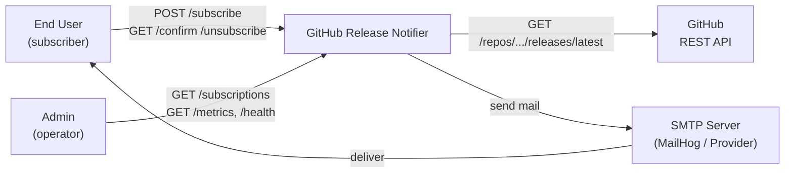
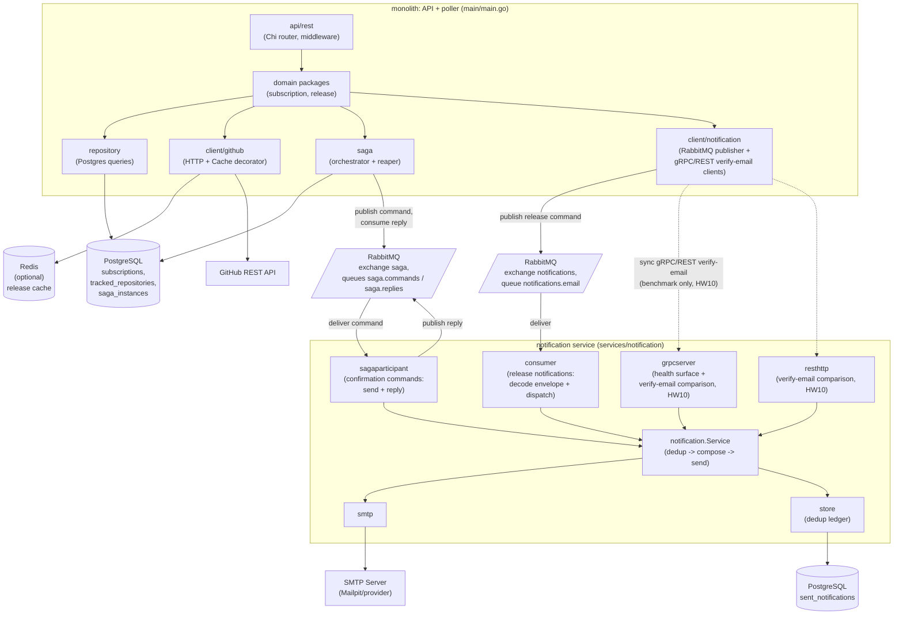
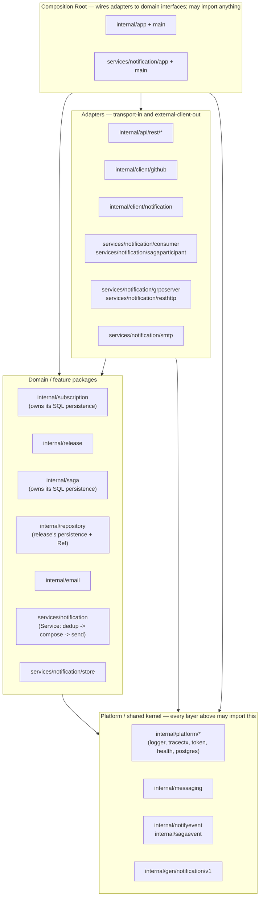
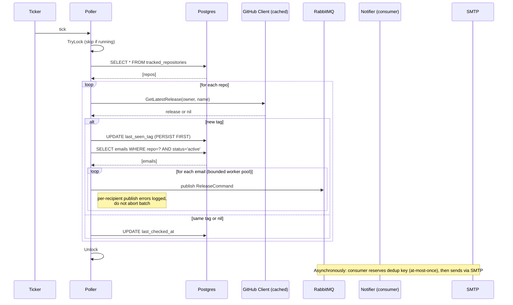
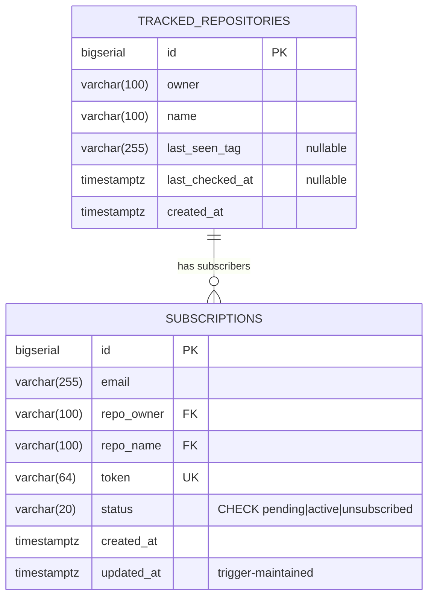

# System Design: GitHub Release Notifier

Author: Project Author | Date: 2026-05-08 | Status: Approved

---

## 1. Overview & Objectives

A backend service that lets users subscribe by email to be notified when a
public GitHub repository publishes a new release. The service runs the full
subscription lifecycle (subscribe → email confirmation → active → unsubscribe)
and a background poller that checks tracked repositories on an interval and
fans out notifications to active subscribers.

**Business value.** Open-source consumers want to learn about new releases of
the libraries they depend on without polling release pages manually or
maintaining their own scripts. The service abstracts that concern behind a
small REST API.

### Out of Scope

- Watching anything other than the **latest release** on a repo (no commit
  watches, no PR watches, no issue watches).
- Private repositories. Authentication to GitHub uses a single static
  service token; per-user OAuth is not implemented.
- Multi-tenant deployment. The service runs as a single instance against a
  single Postgres and a single (optional) Redis.
- Message templating / preferences. The notification email format is fixed.
- Mobile push, SMS, Slack, or any non-email delivery channel.

---

## 2. Requirements

### Functional Requirements

- A user **subscribes** by submitting `{ email, repo: "owner/name" }` to a
  REST endpoint.
- The service validates the repo exists on GitHub before accepting the
  subscription.
- Subscriptions are created in `pending` status and require **email
  confirmation** via a unique tokenised link.
- Confirmation transitions the subscription to `active`.
- Users can **list** their active subscriptions (admin-authenticated by
  `X-API-Key`).
- Users can **unsubscribe** via a tokenised link from any received email.
- A user who has unsubscribed can later **re-subscribe** to the same repo.
- A background poller detects new releases on every tracked repo and notifies
  every active subscriber with **at-most-once** semantics — duplicates are
  prevented; misses on crash are tolerated (see [ADR 0007](adr/0007-persist-before-notify-for-at-most-once.md)).

### Non-Functional Requirements

| NFR              | Target                                       | Notes                                                                                       |
|------------------|----------------------------------------------|---------------------------------------------------------------------------------------------|
| Availability     | Best-effort (single instance)                | Crashes are recovered by restart; no automated failover.                                    |
| Detection latency | <= `SCAN_INTERVAL` + cache TTL (<= 15 min default) | `release.Poller` checks tracked repos; Redis cache (10-min TTL) sits in front of the GitHub API. |
| API latency p95  | < 300 ms for `POST /subscribe`               | Bounded by one GitHub API call (or cache hit) plus two Postgres writes.                     |
| Email semantics  | At-most-once per release per subscriber      | See [ADR 0007](adr/0007-persist-before-notify-for-at-most-once.md).                         |
| Scale ceiling    | ~400 tracked repos, ~10k subscribers         | At default scan interval; rate-limit-bound (see §6).                                        |
| Security         | API-key for admin; tokenised links for users | `crypto/subtle` for constant-time comparison; `crypto/rand` for tokens.                     |
| Observability    | Prometheus `/metrics` + structured logs       | RED metrics on every HTTP route.                                                            |

---

## 3. High-Level Architecture

### 3.1 C4 — Context


```mermaid
graph LR
    User["End User<br/>(subscriber)"]
    Admin["Admin<br/>(operator)"]
    System["GitHub Release Notifier"]
    GitHub["GitHub<br/>REST API"]
    SMTP["SMTP Server<br/>(MailHog / Provider)"]

    User -- "POST /subscribe<br/>GET /confirm /unsubscribe" --> System
    Admin -- "GET /subscriptions<br/>GET /metrics, /health" --> System
    System -- "GET /repos/.../releases/latest" --> GitHub
    System -- "send mail" --> SMTP
    SMTP -- "deliver" --> User
```

### 3.2 C4 — Container


```mermaid
graph TB
    subgraph Monolith["monolith: API + poller (main/main.go)"]
        API["api/rest<br/>(Chi router, middleware)"]
        Domains["domain packages<br/>(subscription, release)"]
        Saga["saga<br/>(orchestrator + reaper)"]
        Repo["repository<br/>(Postgres queries)"]
        GHC["client/github<br/>(HTTP + Cache decorator)"]
        NotifyClient["client/notification<br/>(RabbitMQ publisher +<br/>gRPC/REST verify-email clients)"]

        API --> Domains
        Domains --> Repo
        Domains --> GHC
        Domains --> Saga
        Domains --> NotifyClient
    end

    CmdBroker[/"RabbitMQ<br/>exchange saga,<br/>queues saga.commands / saga.replies"/]
    EventBroker[/"RabbitMQ<br/>exchange notifications,<br/>queue notifications.email"/]

    subgraph Notification["notification service (services/notification)"]
        Consumer["consumer<br/>(release notifications:<br/>decode envelope + dispatch)"]
        SagaParticipant["sagaparticipant<br/>(confirmation commands:<br/>send + reply)"]
        GRPC["grpcserver<br/>(health surface +<br/>verify-email comparison, HW10)"]
        REST["resthttp<br/>(verify-email comparison, HW10)"]
        NotificationApp["notification.Service<br/>(dedup -> compose -> send)"]
        SMTPAdapter["smtp"]
        Ledger["store<br/>(dedup ledger)"]

        Consumer --> NotificationApp
        SagaParticipant --> NotificationApp
        GRPC --> NotificationApp
        REST --> NotificationApp
        NotificationApp --> SMTPAdapter
        NotificationApp --> Ledger
    end

    DB[("PostgreSQL<br/>subscriptions,<br/>tracked_repositories,<br/>saga_instances")]
    NotifyDB[("PostgreSQL<br/>sent_notifications")]
    Cache[("Redis<br/>(optional)<br/>release cache")]
    GitHub["GitHub REST API"]
    SMTPSrv["SMTP Server<br/>(Mailpit/provider)"]

    Repo --> DB
    Saga --> DB
    GHC --> Cache
    GHC --> GitHub
    Saga -- "publish command,<br/>consume reply" --> CmdBroker
    CmdBroker -- "deliver command" --> SagaParticipant
    SagaParticipant -- "publish reply" --> CmdBroker
    NotifyClient -- "publish release command" --> EventBroker
    EventBroker -- "deliver" --> Consumer
    NotifyClient -. "sync gRPC/REST verify-email<br/>(benchmark only, HW10)" .-> GRPC
    NotifyClient -. " " .-> REST
    Ledger --> NotifyDB
    SMTPAdapter --> SMTPSrv
```

The dependency arrow still points **inward** inside each deployable. The
monolith's `subscription` package owns the confirmation step through
`internal/saga` (an **orchestrated saga**, see §4.2): it publishes a command on
its own exchange/queue pair and blocks on the reply, compensating (cancelling
the subscription) on failure or timeout. `release` uses the older, simpler
fire-and-forget path: `internal/client/notification` publishes a command to a
*different* exchange/queue and returns immediately — no reply is expected,
matching the at-most-once semantics of [ADR 0007](adr/0007-persist-before-notify-for-at-most-once.md).
Both command families are consumed by the notifier and dispatched to the same
`notification.Service`. The notification service owns its own Postgres
database and is structured as `notification` (domain), `app`, `consumer`,
`sagaparticipant`, `grpcserver`, `resthttp`, `smtp`, and `store`.

The dotted arrows are the HW10 exercise: `internal/client/notification` also
contains a synchronous gRPC client and a REST client that call the notifier's
`grpcserver`/`resthttp` `VerifyEmail`/`verify-email` surface directly, to
benchmark HTTP/2+protobuf against HTTP/1.1+JSON for the same operation
(`internal/client/notification/verifyemail_bench_test.go`). Nothing in the live
subscribe flow calls this path today — the composition root never wires
`notification.NewVerifier` — so it's a comparison harness the notifier happens
to serve in production, not a load-bearing dependency.

Redis caching is added as a **decorator** on `GitHubClient` — both the base
client and `CachedClient` satisfy the same interface, so the domain layer
never knows whether a cache is in front. The cache is optional: any Redis
error falls through to the GitHub API. The notification split is recorded in
[ADR 0014](adr/0014-extract-notification-microservice.md); the move from
synchronous gRPC to durable broker commands (keeping the dedup ledger) is in
[ADR 0015](adr/0015-sync-grpc-and-dedup-ledger.md) and
[ADR 0016](adr/0016-async-notifications-via-rabbitmq.md).

### 3.3 Layered Architecture (Dependency Direction)

The container diagram above shows *what talks to what over the network*. This
diagram shows the orthogonal view: how packages depend on each other *within*
each deployable, and why. It updates the structure in
[ADR 0001](adr/0001-clean-architecture-with-dependency-inversion.md), which
predates the saga, the message broker, and the notification microservice
split.


```mermaid
graph TB
    subgraph Root["Composition Root — wires adapters to domain interfaces; may import anything"]
        MonoApp["internal/app + main"]
        NotifApp["services/notification/app + main"]
    end

    subgraph Adapters["Adapters — transport-in and external-client-out"]
        RestAPI["internal/api/rest/*"]
        ClientGH["internal/client/github"]
        ClientNotif["internal/client/notification"]
        NotifConsumer["services/notification/consumer<br/>services/notification/sagaparticipant"]
        NotifTransport["services/notification/grpcserver<br/>services/notification/resthttp"]
        SMTPAdapter["services/notification/smtp"]
    end

    subgraph Domain["Domain / feature packages"]
        Sub["internal/subscription<br/>(owns its SQL persistence)"]
        Rel["internal/release"]
        SagaPkg["internal/saga<br/>(owns its SQL persistence)"]
        RepoPkg["internal/repository<br/>(release's persistence + Ref)"]
        Email["internal/email"]
        NotifSvc["services/notification<br/>(Service: dedup -> compose -> send)"]
        Ledger["services/notification/store"]
    end

    subgraph Platform["Platform / shared kernel — every layer above may import this"]
        PlatformPkgs["internal/platform/*<br/>(logger, tracectx, token, health, postgres)"]
        Msg["internal/messaging"]
        Wire["internal/notifyevent<br/>internal/sagaevent"]
        Gen["internal/gen/notification/v1"]
    end

    Root --> Adapters
    Root --> Domain
    Adapters --> Domain
    Domain --> Platform
    Adapters --> Platform
    Root --> Platform
```

**The rule that actually holds, verified against every import in the module:**
domain/feature packages never import adapter or composition-root packages.
Adapters and the composition root import domain packages and platform
packages; domain packages import platform packages and each other (e.g.
`subscription` imports `repository` for `Ref`, `subscription` imports `saga`
to hand off the confirmation step); nothing ever imports back out. This is
enforced by an automated test, not just this diagram — see
[`internal/archtest`](../internal/archtest).

**Honest caveat, not smoothed over:** this codebase does not put every domain
package's persistence in a separate package. `internal/release` externalizes
its SQL into a sibling `internal/repository` package, but `internal/subscription`
and `internal/saga` each keep their own SQL (`repo.go` / `store.go`) inside the
domain package itself — a "package by feature" choice, not "package by layer,"
for those two. The invariant the tests enforce is the one that matters for
testability and swappability (business logic never depends on how it's
delivered or which transport carries it), not "SQL never appears next to
business logic."

The **platform** layer is a deliberate exception to "domain imports nothing
outward": `internal/messaging`'s `Action` enum (`Ack`/`Requeue`/`Drop`) is a
small, transport-agnostic settlement contract that `internal/saga` and
`services/notification/consumer`/`sagaparticipant` all need regardless of
layer, the same way everything needs `internal/platform/logger`. It carries no
AMQP-specific types across the boundary, so depending on it is not the same
as depending on RabbitMQ.

---

## 4. Component Details

| Component       | Responsibility                                       | Technology                  |
|-----------------|------------------------------------------------------|-----------------------------|
| API router      | Routing, rate limiting, API-key auth, metrics       | `go-chi/chi/v5` + custom mw |
| Subscription svc| Validate repo, upsert tracked repo, create sub, request confirmation send, status transitions | Go (pure) |
| Release poller  | Poll tracked repos on a ticker, fan out notification requests | Go + `time.Ticker`          |
| Storage adapter | Parameterised SQL against `subscriptions` and `tracked_repositories` | `database/sql` + `lib/pq` |
| GitHub client   | `GET /repos/.../releases/latest` with retry/backoff  | `net/http` + custom retries |
| Cache decorator | Cache-aside Redis layer over GitHub client           | `redis/go-redis/v9`         |
| Notification client | Publish notification commands to RabbitMQ         | `rabbitmq/amqp091-go`       |
| Notification service | Consume commands; deduplicate, compose, send email | RabbitMQ + `net/smtp` + Postgres (gRPC health surface) |
| Migrations      | Schema versioning at startup                          | `golang-migrate/migrate/v4` |
| Metrics         | RED metrics on HTTP, in-flight gauge                 | `prometheus/client_golang`  |

### 4.1 Key API Contracts

```http
POST /api/subscribe
Content-Type: application/json

{ "email": "user@example.com", "repo": "golang/go" }
```
Response: `200 OK { "message": "Subscription created. Please confirm via email." }`

```http
GET /api/confirm/{token}
GET /api/unsubscribe/{token}
GET /api/subscriptions?email=…    (X-API-Key)
GET /health
GET /metrics
```

The full set is described in `swagger.yaml`.

### 4.2 Subscription Sequence

```mermaid
sequenceDiagram
    actor U as User
    participant API as API
    participant S as Subscription Service
    participant GH as GitHub Client (cached)
    participant DB as Postgres (monolith)
    participant SG as Saga Orchestrator
    participant MQ as RabbitMQ (saga.commands/replies)
    participant P as Notifier (sagaparticipant)
    participant M as SMTP

    U->>API: POST /subscribe {email, repo}
    API->>S: Subscribe(email, repo)
    S->>S: normalizeEmail(email)
    S->>GH: RepoExists(owner, name)
    GH-->>S: true
    S->>DB: GetByEmailAndRepo(email, repo)
    alt active row exists
        S-->>API: ErrAlreadyExists -> 409
    else pending row exists
        S->>DB: UpdateToken(id, newToken)
    else none
        S->>DB: Upsert(tracked_repositories)
        S->>DB: INSERT subscription (status=pending, token)
    end
    Note over S: pending / none paths continue below
    S->>S: build confirm_url (BASE_URL + /api/confirm/{token})
    S->>SG: StartAndWait(SubscriptionData)
    activate SG
    SG->>DB: INSERT saga_instances (awaiting_confirmation, timeout_at)
    SG->>MQ: publish SendConfirmation command
    Note over SG: blocks the request goroutine up to SagaTimeout
    MQ->>P: deliver SendConfirmation command
    P->>M: notification.Service.SendConfirmation<br/>(dedup ledger + SMTP send)
    P->>MQ: publish confirmation_sent / confirmation_failed
    MQ->>SG: deliver reply
    alt confirmation_sent
        SG->>DB: UPDATE saga_instances SET state='completed'
        SG-->>S: nil
    else confirmation_failed
        SG->>SG: compensate() cancels the subscription
        SG->>DB: UPDATE subscriptions status='unsubscribed';<br/>saga_instances state='failed'
        SG-->>S: ErrConfirmationFailed
    else no reply within SagaTimeout
        SG-->>S: ErrConfirmationTimeout (outcome unknown, not "failed")
        Note over SG,DB: The reaper later compensates only if no reply<br/>arrives within its own grace period —<br/>see README "Subscribe Saga"
    end
    deactivate SG
    alt saga error (failed or timeout)
        S-->>API: 503 Service Unavailable
    else saga succeeded
        S-->>API: 200 OK
    end
    Note over U,M: Email arrives with /confirm/{token} link
    U->>API: GET /confirm/{token}
    API->>S: Confirm(token)
    S->>DB: UPDATE status='active'
    API-->>U: 200 OK
```

### 4.3 Poller Sequence


```mermaid
sequenceDiagram
    participant T as Ticker
    participant P as Poller
    participant DB as Postgres
    participant GH as GitHub Client (cached)
    participant MQ as RabbitMQ
    participant N as Notifier (consumer)
    participant M as SMTP

    T->>P: tick
    P->>P: TryLock (skip if running)
    P->>DB: SELECT * FROM tracked_repositories
    DB-->>P: [repos]
    loop for each repo
        P->>GH: GetLatestRelease(owner, name)
        GH-->>P: release or nil
        alt new tag
            P->>DB: UPDATE last_seen_tag (PERSIST FIRST)
            P->>DB: SELECT emails WHERE repo=? AND status='active'
            DB-->>P: [emails]
            loop for each email (bounded worker pool)
                P->>MQ: publish ReleaseCommand
                Note right of P: per-recipient publish errors logged,<br/>do not abort batch
            end
        else same tag or nil
            P->>DB: UPDATE last_checked_at
        end
    end
    P->>P: Unlock
    Note over MQ,M: Asynchronously: consumer reserves dedup key (at-most-once), then sends via SMTP
```

Why persist before notify: see [ADR 0007](adr/0007-persist-before-notify-for-at-most-once.md).

---

## 5. Data Model & Storage


```mermaid
erDiagram
    TRACKED_REPOSITORIES ||--o{ SUBSCRIPTIONS : "has subscribers"

    TRACKED_REPOSITORIES {
        bigserial id PK
        varchar(100) owner
        varchar(100) name
        varchar(255) last_seen_tag "nullable"
        timestamptz last_checked_at "nullable"
        timestamptz created_at
    }

    SUBSCRIPTIONS {
        bigserial id PK
        varchar(255) email
        varchar(100) repo_owner FK
        varchar(100) repo_name FK
        varchar(64) token UK
        varchar(20) status "CHECK pending|active|unsubscribed"
        timestamptz created_at
        timestamptz updated_at "trigger-maintained"
    }
```

### 5.1 Indexes & Constraints

| Object                                      | Purpose                                                    |
|---------------------------------------------|------------------------------------------------------------|
| `UNIQUE(owner, name)` on tracked_repositories | One row per repo. Target of composite FK.                |
| `UNIQUE(token)` on subscriptions            | Tokens are globally unique.                                |
| `CHECK status IN (pending, active, unsubscribed)` | Status state machine enforced in DB.                  |
| Partial UQ `idx_subscriptions_email_repo_active` | One non-terminal sub per (email, repo). [ADR 0008](adr/0008-partial-unique-index-for-resubscription.md). |
| Partial idx `idx_subscriptions_repo_status` | Poller lookup of active subscribers per repo.              |
| Partial idx `idx_subscriptions_email_status`| Admin lookup of a user's active subscriptions.             |
| FK `subscriptions(repo_owner, repo_name) → tracked_repositories(owner, name) ON DELETE CASCADE` | Referential integrity; orphan cleanup. |
| Trigger `trg_subscriptions_updated_at`      | Server-side `updated_at = NOW()` on every UPDATE.          |

### 5.2 Caching Strategy

- **Layer:** Redis, optional, cache-aside.
- **Keys:** `github:repo_exists:{owner}/{name}` and `github:release:{owner}/{name}`.
- **TTL:** 10 minutes (configurable via `REDIS_CACHE_TTL`).
- **Negative results not cached** — caching `nil` would mean missing the
  first release for up to TTL. Only positive results go into the cache.
- **Failure mode:** any Redis error is logged and falls through to a direct
  GitHub API call.

---

## 6. Capacity & Scale Estimates

Back-of-the-envelope for a single-instance deployment:

- GitHub authenticated rate limit: 5,000 req/hr.
- Default scan interval: 5 min → 12 scans/hr.
- Per-scan API budget without cache: `5000 / 12 = 416 repos`.
- With Redis cache (10-min TTL) and ~50% hit rate at steady state:
  effective ceiling ≈ 800–1000 tracked repos.
- Subscriber count is bounded by Postgres row count, not GitHub. 1M
  subscriber rows in `subscriptions` is well within Postgres comfort zone
  with the current indexes.
- Email fan-out per release is decoupled: the poller **publishes** one command
  per subscriber (via a bounded worker pool) and returns; the notifier drains
  the durable queue and sends over SMTP. Publishing is cheap, so fan-out alone
  is unlikely to make the poller mutex skip a tick. The next scaling step, when
  notifier SMTP throughput is the bottleneck, is to run multiple notifier
  consumers off the shared queue.

---

## 7. Failure Modes & Resilience

| Failure Scenario                            | Mitigation                                                                                  |
|---------------------------------------------|---------------------------------------------------------------------------------------------|
| Postgres unreachable at boot                | `PingContext` fails fast; binary exits; orchestrator restarts.                              |
| Postgres unreachable mid-flight             | Per-query errors propagate; subscribe returns 5xx; poller logs and continues next tick.     |
| Redis unreachable                           | Cache decorator falls through to GitHub API; logs the error. No user-visible impact.        |
| GitHub API 429                              | 3-tier retry: `Retry-After`, `X-RateLimit-Reset` (capped 120 s), exp. backoff (1/2/4 s).    |
| GitHub API 5xx                              | Not retried — surfaced to caller. Only 429 triggers the retry chain (see row above).        |
| Broker unreachable on subscribe             | Publish fails; subscription rolled back to `unsubscribed` so the user can retry.            |
| Notifier SMTP fails after broker accepted   | Row stays `pending`; re-subscribing refreshes the token and resends (no permanent zombie).  |
| Publish fails on notification fan-out       | Per-recipient publish error logged; loop continues; that command is not sent.               |
| Transient SMTP failure on the consumer      | Consumer returns `Requeue`; broker redelivers; dedup ledger makes the retry idempotent.     |
| Process crash mid-fan-out                   | At-most-once: tag persisted, some recipients miss this release. [ADR 0007](adr/0007-persist-before-notify-for-at-most-once.md). |
| Race: two concurrent subscribes (same email+repo, no existing row) | Partial unique index blocks the second INSERT atomically.              |
| Race: two concurrent re-subscribes over the same `pending` row | `UpdateToken`'s CAS (`WHERE id=? AND token=?`) makes one win and one lose; the loser gets `ErrAlreadyExists` instead of emailing a token it never wrote. |
| Race: two poller ticks overlap              | Mutex on the poller causes the second tick to be skipped with a log entry.                  |
| Token brute-force                           | 256-bit entropy from `crypto/rand`; not feasible.                                           |
| Header injection in email                   | `\r` and `\n` stripped from header values in the SMTP mailer.                               |
| API-key timing attack                       | `crypto/subtle.ConstantTimeCompare`.                                                        |
| Rate-limit bypass via `X-Forwarded-For`     | Header only honoured when `TRUSTED_PROXY=true`.                                             |

---

## 8. Security Posture

- **AuthN/AuthZ:** Admin endpoint (`/api/subscriptions`) gated by static
  `X-API-Key`; user endpoints gated by per-subscription tokens
  (256-bit, `crypto/rand`, hex-encoded). Tokens are never returned in JSON
  responses (`json:"-"`); they only appear in confirmation/unsubscribe
  email links.
- **Encryption in transit:** TLS terminated at the deployment edge (out of
  scope for this binary). Application speaks plain HTTP to the edge.
  SMTP connections must use encrypted transport (STARTTLS or SMTPS) with
  certificate validation in production and non-local environments; plain
  SMTP-with-AUTH is permitted only for local development with MailHog-like
  test servers.
- **SQL injection:** every query uses positional parameters
  (`$1, $2, …`). No string interpolation. Confirmed by
  `internal/subscription/repo.go` and `internal/repository/store.go`.
- **Path traversal in GitHub URLs:** owner and repo segments pass through
  `url.PathEscape` before interpolation.
- **PII in logs:** subscriber emails are never written to error logs in the
  poller fan-out; repo identifier is logged instead.
- **Threat model not addressed:** abusive subscribers spamming `POST
  /subscribe` to send confirmation emails to victims. Mitigated partially
  by per-IP rate limiting; not by email-level rate limiting.

---

## 9. Observability

- **Logs:** structured with `log/slog`. Levels: error for failed external
  calls, info for successful state transitions and poller ticks.
- **Metrics:** Prometheus on `/metrics`:
    - `http_requests_total{method,path,status}` — RED rate + errors.
    - `http_request_duration_seconds{method,path}` — RED duration histogram.
    - `http_requests_in_flight` — concurrency gauge.
    - High-cardinality protection via `chi.RouteContext().RoutePattern()`
      (so `/api/confirm/{token}` is one label, not one-per-token).
    - `/metrics` endpoint excluded from itself to avoid scrape noise.
- **Health:** `GET /health` returns 200 if Postgres `PingContext` succeeds.

---

## 10. Trade-offs and Alternatives Considered

The full list of accepted trade-offs is below. Three of them have a dedicated
ADR because the decision is non-obvious and a future reader could reasonably
question it. The rest are tactical choices that match the project's scope.

| Decision                          | Trade-off Accepted                                                          | Where to read more                                                              |
|-----------------------------------|------------------------------------------------------------------------------|---------------------------------------------------------------------------------|
| Layered + DI architecture         | Mild boilerplate for single-impl interfaces.                                 | [ADR 0001](adr/0001-clean-architecture-with-dependency-inversion.md)            |
| Persist-before-notify             | Some subscribers may miss a release on crash; never a duplicate.             | [ADR 0007](adr/0007-persist-before-notify-for-at-most-once.md)                  |
| Partial unique index              | Postgres-specific; encodes a state-dependent rule in DDL.                    | [ADR 0008](adr/0008-partial-unique-index-for-resubscription.md)                 |
| Polling over webhooks             | Up to `SCAN_INTERVAL` detection latency; rate-limit budget.                  | This document, §3, §6.                                                          |
| Async fan-out via message broker  | A broker to operate; "accepted" ≠ "delivered" (eventually consistent).       | [ADR 0016](adr/0016-async-notifications-via-rabbitmq.md), §6.                  |
| Orchestrated saga for subscribe   | Subscribe blocks on the confirmation round trip; a reaper to operate.        | README (Subscribe Saga)                                                         |
| Cache-aside Redis (TTL only)      | Up to TTL extra latency; no proactive invalidation.                          | This document, §3.2, §5.2.                                                      |
| Direct SMTP, no transactional API | Deliverability tuning is on us; no bounce feedback loop.                     | README §"Trade-offs".                                                           |
| In-memory rate limiter            | State lost on restart; not safe across multiple instances.                   | README §"Trade-offs".                                                           |

---

## 11. Open Questions

- [ ] Should re-subscription after **unsubscribe** revive the original row
      instead of inserting a new one? Current behaviour creates a new row; the
      old `unsubscribed` row stays as history. (Re-subscribing over a still
      **pending** row already refreshes that row in place — see README.)
- [ ] At what fan-out volume do we scale the notifier to multiple consumers off
      the shared queue? The poller already publishes via a bounded worker pool;
      the next bottleneck is notifier-side SMTP throughput (§6).
- [ ] Do we need a `purge_unsubscribed_after` cleanup job? The
      `unsubscribed` rows currently grow without bound (see
      [ADR 0008](adr/0008-partial-unique-index-for-resubscription.md)).
- [ ] Is the API-key-only admin endpoint sufficient, or do we want per-user
      auth for `GET /subscriptions`?
- [ ] When (and how) do we add bounce / complaint handling? The natural path
      is moving to a transactional email provider (SendGrid / Mailgun / SES)
      behind the existing `Mailer` interface.

---

## 12. Glossary

- **At-most-once detection** - given the same release, the poller produces
  notifications **at most one time**. Crashes can drop them; never duplicate.
- **Cache-aside** — the application checks the cache first; on miss, it
  reads the source of truth and stores the result. Distinct from
  write-through.
- **Decorator** — a struct that wraps another, satisfying the same
  interface, adding a behaviour (here: caching).
- **Fan-out** — sending one logical event (a release) to N recipients.
- **Partial unique index** — uniqueness enforced only on rows matching a
  predicate (here: `WHERE status != 'unsubscribed'`).
